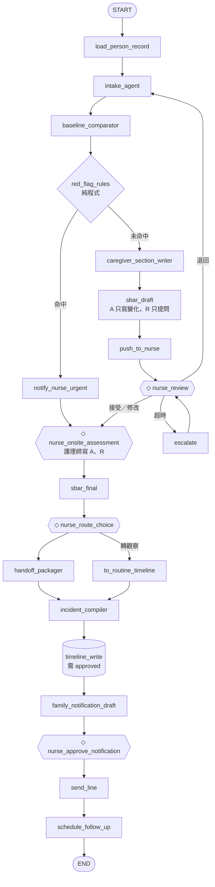

# Personal Health Twin — 一份能跟著人走的紀錄

> 每個人有一份屬於自己、跟著他一輩子的健康紀錄（Personal Health ID），和一個替這份紀錄說話的 agent。**今天先做通道 1**：它先學會聽照顧他的人說話。

BUILDMODE 2026 × SITCON ・ Healthcare AI 賽道。紀錄屬於本人，誰能看由本人在 Care Circle 決定；家與機構都是場域：住宿式長照機構是這份紀錄今天接上的第一個場域，同一份紀錄回到家裡、進到醫院都跟著人走。照服員講一句話 → AI 只抽取成八個觀察維度、不判斷 → 護理師按一下 → 醫師巡診看一頁；穿戴訊號進來時先問人「可能跌倒了嗎」，再由護理師看事件資訊包。AI 只起草，人才定稿；每一行都有來源；任何信心值、機率、分數不出現在照護者與醫師介面。

四扇門：本人（`/me`：今天、終身時間軸、問我的紀錄、Care Circle）・家屬／照護者（`/caregiver`：對話、四鍵驗證）・護理師（`/nurse`：Clinical Queue）・醫師（`/doctor`：一人一頁）。願景全文：[docs/VISION_personal_health_twin.md](docs/VISION_personal_health_twin.md)（實作範圍以 [docs/ARCHITECTURE.md](docs/ARCHITECTURE.md) 與 [docs/HANDOFF.md](docs/HANDOFF.md) 為準）。


目前是可獨立開發／驗證的 **synthetic-data demo**，不是可上線的醫療資料平台。已加入個人帳號、伺服器 session、病人／用途授權與拒絕稽核；仍不要接真實病人資料或公開暴露服務。請先看 [安全契約與既有資料升級](docs/SECURITY.md)、[review](docs/PROJECT_REVIEW.md)、[驗證範圍](docs/VALIDATION.md) 與 [分期 roadmap](docs/ROADMAP.md)；只需修改這個 repo，舊來源已可還原封存。沒有模型 API 也可使用 `MODEL_PROVIDER=mock` 開發與驗證，不能把 mock 當真模型能力。

---

## 問題與制度出處

醫師永遠不夠（WHO：2030 年全球醫療人力短缺 1,000 萬），台灣老得最快（65 歲以上 19.9%，2050 年 38.4%），但每位住民身邊都有一雙每天看著他的眼睛——照服員。他們看得到「今天不太想吃、走路變慢、叫她名字反應慢」，只是不會打字、不會填表、可能不講中文，所以醫療從來沒聽見。

制度依據（衛福部《長期照顧十年計畫 3.0（115–124 年）核定本》，行政院 2025/12/31 核定）：

| 頁 | 內容 |
|---|---|
| p.8 | 住宿式長照機構 1,687 家、118,716 床 |
| p.19 | 減少照護機構住民就醫方案：1,681 家機構、529 家醫療機構、13.5 萬人受益 |
| p.26 | 長照人員資訊能力落差、照顧紀錄數位化推進緩慢 |
| p.68–69 | 住宿機構整合照護模式、論人計酬；在宅醫療照護資訊平台 |
| p.70–72 | 多家醫療機構診療、無專責醫療機構負起住民健康管理 |
| p.81 | 住宿機構品質獎勵：指標含「建構照顧資訊系統」 |
| p.101 | 住宿機構住民失智症盛行率 86.17% |
| p.147 | KPI「照護機構由同一醫療院所提供服務率」69.8% → 2035 年 90% |

另：長照機構評鑑基準 B8（特約醫師巡診、緊急後送、每月診察有紀錄）、長照服務法第 33 條、長照機構定型化契約範本（113 年）。完整敘事見 [docs/一份能跟著人走的紀錄_摘要與願景.md](docs/一份能跟著人走的紀錄_摘要與願景.md)。

---

## 架構

設計稿：[docs/ARCHITECTURE.md](docs/ARCHITECTURE.md)。兩張 LangGraph 圖是節點名稱的唯一來源（`tests/test_mermaid_sync.py` 會比對）。

### Path A：急症（需看醫師，不到 119）



### Path B：日常 → 本地歷史 → 巡診

```mermaid
flowchart TD
    subgraph SHIFT[每班]
        s1[load_person_record] --> s2[intake_agent] --> s3[baseline_comparator] --> s4{red_flag_rules}
        s4 -- 命中 --> s5[notify_nurse_urgent] --> sA[to_path_a]
        s4 -- 未命中 --> s6[minimal_sbar_draft] --> s7{{"◇ nurse_10s_confirm"}} --> s8[(timeline_write)] --> s9[timeline_curator]
    end
    subgraph ROUND[巡診前]
        r1[roster_agent] --> r2[trend_analyzer ×N] --> r3[familiarization_writer ×N] --> r4{{"◇ head_nurse_edit_list"}} --> r5[publish_round_pages] --> r6{{"◇ doctor_round"}} --> r7[order_ingest]
        r7 --> r8[order_to_caregiver_notes] --> r12[(timeline_write)]
        r7 --> r9[baseline_update_proposal] --> r10{{"◇ nurse_confirm_baseline"}} --> r11[(baseline_write)] --> r12
    end
```



原圖：[docs/langgraph_path_a_incident.mermaid](docs/langgraph_path_a_incident.mermaid)、[docs/langgraph_path_b_routine_round.mermaid](docs/langgraph_path_b_routine_round.mermaid)。

**層級**：`apps/api/core/settings.py::get_model()`（唯一的模型工廠：`MODEL_PROVIDER=openai` → `ChatOpenAI(model=MODEL_PINNED, temperature=0)`，`MODEL_PINNED=gpt-5.6-luna`（gpt-5.x 另加 `reasoning_effort="none"`）；訊息順序固定「system → 住民紀錄區塊 → 本輪」以吃到 prompt caching，每次呼叫的 token 與成本估算在 trace `llm.usage`；deep agent 與所有 graph 節點都經它）→ `apps/api/graphs`（LangGraph，PostgresSaver checkpointer，`interrupt()` + `Command(resume=…)`，APScheduler 超時 worker）→ `apps/api/agents`（每位住民一個 deepagents 實例，唯讀檔案系統；三個 subagent 只回結構化結果）→ `apps/api/record`（PersonRecord 讀寫層，`write_timeline` 是唯一寫入點）→ `records/{patient_id}/`（一人一個目錄，跟著人走）。

---

## 快速開始

需要：Python 3.12（[uv](https://docs.astral.sh/uv/)）、Node 24、pnpm 10.12.1、PostgreSQL 17；Windows 使用 PowerShell 7。只做程式檢查不需要啟動資料庫，完整啟動驗收才需要 PostgreSQL。只 clone 此 repo 即可，不需要 `health-ref` 或外層 docs。

**macOS / Linux**
```bash
cp .env.example .env               # MODEL_PROVIDER=openai + OPENAI_API_KEY；沒 key 會自動退回 mock
cd apps/api && uv sync --frozen && cd ../..
cd apps/web && pnpm install --frozen-lockfile && cd ../..
docker compose up -d postgres      # 沒 Docker：make db-local（Homebrew postgresql@17）
make migrate                       # PostgresSaver.setup() + threads 表（只在這裡跑）
make seed                          # 3 住民 × 14 天 × 2 班 + 第 12 天一次急症 → records/
make api                           # http://localhost:8000  (/docs 有 OpenAPI)
make web                           # http://localhost:3000
```

**Windows**
```powershell
if (!(Test-Path .env)) { Copy-Item .env.example .env } # 保留已有設定
.\scripts\dev.ps1 setup            # uv sync + pnpm install（不碰 records、不碰資料庫）
docker compose up -d postgres     # 或自行啟動 PostgreSQL 17，確認 .env DATABASE_URL
.\scripts\dev.ps1 migrate          # 建 checkpoint 與 registry 表
.\scripts\dev.ps1 seed             # 僅首次示範：會清空 records\，需輸入 yes
.\scripts\dev.ps1 api              # 另開一個終端跑 .\scripts\dev.ps1 web
.\scripts\dev.ps1 check            # 完整 API + web gate；不使用真模型、不發 LINE
.\scripts\dev.ps1 help             # 看所有指令；status 看目前環境與資料狀態
# 部署前（只在明確 production 環境執行）
uv run --directory apps/api python ../../scripts/preflight_security.py --production
# records 備份先驗證，再還原到隔離目錄
uv run --directory apps/api python ../../scripts/backup_records.py create --root ../../records --output records.zip
uv run --directory apps/api python ../../scripts/backup_records.py verify --archive records.zip
```

> `check` 不重設既有紀錄；API 正常使用會寫資料，`migrate` 會建立資料表，`codegen` 會更新產生檔。
> `init/reset/seed/clean-records` 會清資料，先列出目標並要求確認；不要當日常啟動指令。
> 缺 pnpm 會明確失敗。只需要 API 時可用 `setup -ApiOnly`／`check -ApiOnly`，但不算完整驗收。

畫面：`/` 選角色（cookie）→ 角色首頁（`/caregiver` 住民卡、`/nurse` 紅燈橫幅→等我確認→今日總覽＋巡診準備、`/doctor` 巡診名單）→ 病人頁 `/p/{id}?tab=who|timeline|docs|talk`（這份紀錄的唯一入口）。`talk` 是 LINE 式聊天：每一題都由 intake_agent（LLM）依八維度缺口、profile、基線與已問過的題決定並附 reason，只有語音與文字輸入，上限 4 題；紅燈時程式先通知護理師、對話繼續由 agent 問關鍵事實並即時同步到護理師端；沒有模型就報錯停止。每則回覆下有 Agent 活動列（收合「花了 2.3 秒，7 步」，展開＝`GET /debug/trace/{thread_id}` 的內容）。`docs` 放護理師的等我確認（Path A 審核、10 秒確認）、RoundPage（可列印 A4）、事故檔、注意事項。逐步驗收指令見 [docs/ACCEPTANCE.md](docs/ACCEPTANCE.md)。

完整檢查：Windows 用 `.\scripts\dev.ps1 check`；macOS/Linux 用 `make check`。涵蓋 ruff check／format、API tests、web lint／tests、腳本回歸、臨時資料 mock eval、唯讀 codegen 比對、web build 後 typecheck。獨立資料庫＋重啟＋瀏覽器驗證見 [VALIDATION](docs/VALIDATION.md)；程式 gate 成功不等於完整臨床流程都測過。

---

## 資料模型與 provenance

```
PersonRecord（records/{patient_id}/）
├── profile.json      慢病、過敏、DNR、緊急聯絡人、特約醫療機構、目前所在（FHIR-lite 命名）
├── baseline.json     八維度的「平常」，每筆 valid_from / valid_to / set_by；只在 ◇nurse_confirm_baseline 後更新
├── timeline/         只增不改：Observation | Incident | Encounter | Order（每筆 status/confirmed_by/provenance）
├── documents/        RoundPage | HandoffPage | VisitPage | IncidentFile | CaregiverNotes，帶 generated_from
└── provenance.jsonl  每行：source, author, confirmed_by, ts, language_original
```

八維度（觀察架構參考 INTERACT Stop and Watch（Florida Atlantic University），項目措辭與分類為本專案自訂，未複製原工具）：`intake` 進食與飲水｜`elimination` 排泄｜`function` 活動與日常功能｜`cognition` 意識、認知、情緒、溝通｜`sleep` 睡眠｜`skin` 皮膚與傷口｜`pain` 疼痛｜`vitals` 生命徵象與呼吸症狀。跨維度旗標 `seems_different`；事件快捷 `fall / medication_issue / choking / behavior`。

每一行保留 `language_original`（預設 `zh-TW`）。provenance 六種來源：`caregiver_said | ai_extracted | nurse_assessed | nurse_confirmed | doctor_ordered | system_derived`。AI 的行永遠是 `ai_extracted`；只有 `nurse_confirmed` 的行會出現在給醫師的頁面。ISBAR 的 A／R 是兩組欄位：AI 只能寫 `ai_change_vs_baseline` 與 `ai_questions_for_nurse`；`nurse_assessment` / `nurse_recommendation` 只有護理師能寫。

Schema 單一來源：[packages/schema/record_schema/models.py](packages/schema/record_schema/models.py)（Pydantic v2）→ `make codegen` → [packages/schema/ts/index.ts](packages/schema/ts/index.ts)。

---

## 紅燈規則聲明（非診斷）

[apps/api/red_flags/rules.py](apps/api/red_flags/rules.py) 是純程式，不呼叫 LLM（有測試檢查 import）。命中即推播護理師並跳過起草。輸出只呈現「觀察到的事實 + 建議聯絡護理師」，不輸出等級或分數。每條規則 `requires_validation=True`：**需護理師／醫師驗證，非診斷、非檢傷分級。**

| id | 條件 | 動作 |
|---|---|---|
| RF01 | 意識改變、新發生混亂或嗜睡 | 立即通知 |
| RF02 | 體溫 ≥38.5°C 或 <35°C | 立即通知 |
| RF03 | 呼吸 <8 或 ≥25／分；SpO₂ <92% 或較基線降 ≥3% | 立即通知 |
| RF04 | 收縮壓 <90 或 >220；心率 <40 或 >130 | 立即通知 |
| RF05 | 跌倒且頭部撞擊或使用抗凝血劑 | 立即通知 |
| RF06 | 發燒＋心跳快＋意識改變同時出現 | 立即通知 |
| RF07 | 進食量驟降、24h 未排尿 | 記錄觀察 |
| RF08–10 | 胸痛、呼吸困難、跌倒後無法起身（ARCHITECTURE §4 關鍵字硬條件） | 立即通知 |

---

## 評測結果

`apps/api/eval/run.py` 對 **46 條**合成照護者語句（zh-TW，含模糊句與 5 條誘導下診斷的句子；多語語句集為第二階段）計算。三個模型設定同日各跑一次（2026-09-05），逐句結果在 [apps/api/eval/results.md](apps/api/eval/results.md)：

| 指標 | gpt-4.1-2025-04-14 | gpt-5.6-luna（reasoning none） | **gpt-5.6-luna（intake reasoning low）** ← 採用 |
|---|---|---|---|
| Hallucination rate（有 ≥1 個多抽的標籤） | 2/46 = 4.3% | 4/46 = 8.7% | 3/46 = 6.5% |
| Omission rate（有 ≥1 個漏抽的標籤） | 1/46 = 2.2% | 2/46 = 4.3% | 2/46 = 4.3% |
| Provenance 正確率（source=ai_extracted ∧ raw_quote ⊂ 原文） | 46/46 = 100% | 46/46 = 100% | 46/46 = 100% |
| 輸出不含診斷詞／誘導句不下診斷 | 46/46／5/5 | 46/46／5/5 | 46/46／5/5 |
| 逐句全對 | 43/46 | 41/46 | 42/46 |
| 每句成本（估算，含 85% 快取命中） | — | $0.00025 | $0.00025 |

樣本只有 46 句，多抽最多相差 2 句、漏抽最多相差 1 句；單次小樣本不足以證明模型優劣。這些是 2026-09-05 保存的歷史評測，本輪沒有重新呼叫真模型。引用子字串、詞彙檢查與人工確認是必要邊界，但不是回答逐句有證據或臨床安全性的充分證明。

**選 gpt-5.6-luna（intake `reasoning_effort=low`）的理由**：同一個模型同時跑 intake、個人 deep agent 與三個 subagent，成本是 gpt-4.1 的數分之一（每句約 $0.00025、三位住民巡診約 $0.012），prompt caching 命中率 85% 以上；low 走 Responses API，在 intake 這兩個 prompt 上不產生 reasoning tokens、成本與 none 相同，但 hallucination 從 8.7% 降到 6.5%。deep agent 與其他節點維持 `none`（chat completions 的 function tools 需要）。設定：`MODEL_PINNED=gpt-5.6-luna`、`INTAKE_REASONING_EFFORT=low`（`.env`）。

守門與模型無關：`core/llm.py::_guard_quotes` 會丟掉任何不是原文子字串的 raw_quote；抽取結果依「句子＋住民＋模型＋當日」快取（`records/{id}/extract_cache.json`），同一句只送模型一次。

2026-09-06 的 mock gate：多抽 2/46、漏抽 0/46、來源子字串檢查 46/46、誘導句 5/5；這是程式回歸，不是上述真模型結果，也不會覆寫它。數字與限制見 [VALIDATION](docs/VALIDATION.md)。

---

## 限制與 mock 清單

| 真做 | 假做／寫死 |
|---|---|
| Intake（語音→八維度，多輪聊天追問上限 4 題；zh-TW）| 影像分析（固定摘要）|
| — | 多語（id／vi）介面與翻譯：第二階段（schema 的 `lang` / `language_original` 已保留，預設 zh-TW）|
| Baseline Comparator（規則）| Timeline Curator 只做結構（seed 資料先整理好）|
| 紅燈規則＋推播 | 119／特約醫療機構通知（畫面提示）|
| ISBAR 預填＋護理師確認畫面＋退回＋超時升級（worker）| LINE 家屬通知（未設 token 時只顯示）|
| Incident Compiler → 兩區塊事故檔 + 後送頁 | 出院摘要 PDF（`ingest/discharge_pdf.py` mock）|
| Familiarization Writer subagent 寫 RoundPage（①②③④ 由模型依 timeline／baseline 生成，程式驗證規則，可列印） | 生命徵象量測（`ingest/vitals.py` 寫死）|
| Order Ingest → 照護者三件事（中文）＋ baseline 提案＋確認 | Roster 排序（3 位住民）|
| Health ID + Care Circle（本人授權／撤銷、access log）；本人 App（終身時間軸、問我的紀錄只引用既有行）；FollowUp task/outbox 與 manifest backup | Health Graph：第二階段（尚未做）|
| 通道 4 模擬跌倒訊號 → 「可能跌倒」→ 照護者四鍵 → 事件資訊包；合成 FHIR Patient + Observation Bundle adapter（pending review、可匯出） | 真實穿戴裝置、醫院 EHR／完整 FHIR server 對接：仍是第二階段|
| 01 活體數位孿生：向量解剖圖（EMBL-EBI Expression Atlas anatomogram，Apache-2.0，`apps/web/public/anatomy/`）＋八維度熱點；3D 分身（模型來自團隊 health-ref，`apps/web/public/models/LICENSE.txt`）、沙盤模擬、穿戴每日指標（模擬） | 真實穿戴資料、分身動畫：第二階段 |

其他限制見 [docs/KNOWN_ISSUES.md](docs/KNOWN_ISSUES.md)。本機沒有 `OPENAI_API_KEY` 時所有流程以 mock（確定性抽取）跑完；`deepagents / langgraph / langchain` 鎖精確版本（alpha）。**只用合成資料**：`data/seed/` 的姓名為代號，repo 內沒有任何真實個資。

---

## 文件

哪份管什麼（衝突時以 [CLAUDE.md §0.2](CLAUDE.md) 的分工表為準）：

| 文件 | 管什麼 |
|---|---|
| [docs/DIRECTORY_GUIDE.md](docs/DIRECTORY_GUIDE.md) | 每個資料夾、文件用途、文件權威順序與接手檢查清單 |
| [docs/OVERVIEW.md](docs/OVERVIEW.md) | 全貌，給第一次接觸的人 |
| [CLAUDE.md](CLAUDE.md) | 開發規則、紅線、不可做的事 |
| [docs/ARCHITECTURE.md](docs/ARCHITECTURE.md) | **已採納**的架構：層級、通道、節點、demo 範圍、未決事項 |
| [docs/VISION_personal_health_twin.md](docs/VISION_personal_health_twin.md) | 長期願景。**不是規格** |
| [docs/ROADMAP.md](docs/ROADMAP.md) | 之後做什麼、依什麼順序、**明確不做什麼** |
| [docs/HANDOFF.md](docs/HANDOFF.md) | 只管目前進度與下一步 |
| [docs/DECISIONS.md](docs/DECISIONS.md) | 每個決定的日期／理由／誰 |
| [docs/KNOWN_ISSUES.md](docs/KNOWN_ISSUES.md) | 已知問題與繞法 |
| [docs/ACCEPTANCE.md](docs/ACCEPTANCE.md) | 驗收步驟與指令 |
| [docs/CONSOLIDATION.md](docs/CONSOLIDATION.md) | 工作區整併的來源去向清單 |
| [docs/PROJECT_REVIEW.md](docs/PROJECT_REVIEW.md) | 本輪實碼 review、風險與補強優先序 |
| [docs/OPTIMIZATION_PLAN.md](docs/OPTIMIZATION_PLAN.md) | 有公開來源的優化候選契約；補充 ROADMAP、不代表已實作 |
| [docs/VALIDATION.md](docs/VALIDATION.md) | 可重現驗證、實際結果與未涵蓋範圍 |
| [docs/proposals/](docs/proposals/) | 外部提案，**未採納**；描述的不是這個 repo |

其他：[docs/design.md](docs/design.md)・[docs/UI_AUDIT.md](docs/UI_AUDIT.md)・[docs/UIUX_OMNI_TWIN.md](docs/UIUX_OMNI_TWIN.md)・[docs/VIDEO.md](docs/VIDEO.md)

## LICENSE

Apache-2.0，見 [LICENSE](LICENSE)。
