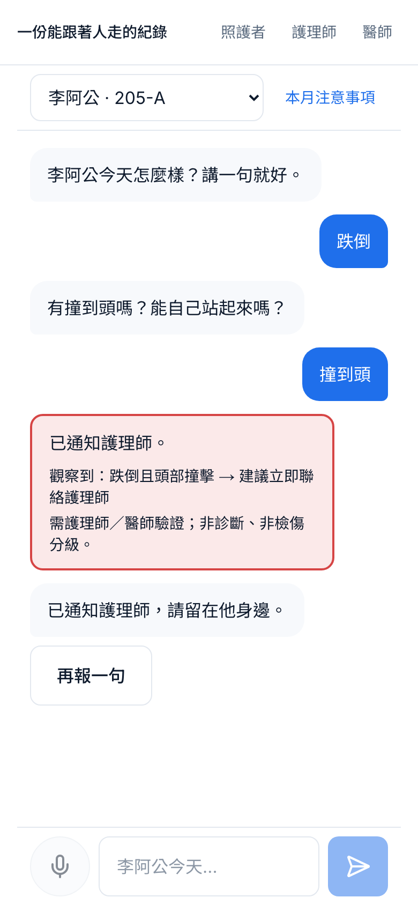

# ACCEPTANCE — §12「Demo 完成定義」驗收

日期：2026-09-05 ・ 執行者：Claude（自主）・ Repo：https://github.com/chrisyang-c/record-follows-person
環境：macOS（Darwin 25.3）、Python 3.12（uv）、Node 24（pnpm 10.12.1）、Homebrew postgresql@17（本機無 Docker）。
模型：`MODEL_PROVIDER=openai`、`MODEL_PINNED=gpt-4.1-2025-04-14`；`settings.get_model()` → `ChatOpenAI(model=MODEL_PINNED, temperature=0)`，deep agent 與所有呼叫 LLM 的 graph 節點都只經它。`.env` 已填 `OPENAI_API_KEY`，`/health` 顯示 `effective_provider: "openai"`。
Demo 語言：**只用 zh-TW**。介面沒有語言切換與翻譯步驟；schema 的 `lang` 與 provenance 的 `language_original` 保留、預設 `"zh-TW"`；多語（id／vi）為第二階段（CLAUDE.md §12、README 已註明）。

---

## 照護者端（重做：LINE 式聊天引導，390px 手機優先）

| | |
|---|---|
|  |  |
| 第一則訊息＋事件按鈕列（跟平常不一樣／跌倒／拒藥／嗆咳／打人）；底部固定輸入列：麥克風＋文字＋送出，皆 56px | 先講一句「王伯今天只吃一半」→ 系統依八維度判斷缺什麼，一次只問一題，2–4 個快速回覆，永遠有「不知道」 |
|  |  |
| 追問上限 4 題（已提到的維度不再問）→「我聽到的是：王伯今天吃一半、晚上起來 3 次…對嗎？」（照護者口吻）→ 對／需要護理師現在來看／不對再說 | 李阿公按「跌倒」→ 問「有撞到頭嗎？」→ 點「撞到頭」→ 紅燈關鍵字一出現立即中止追問，顯示「已通知護理師」（Path A 已啟動） |

規格對應：氣泡 `--surface`／`--primary`、白底、Noto Sans TC、無頭像、無「AI 思考中」、無星星、無漸層陰影；追問規劃是規則（`apps/api/ingest/intake_dialog.py`），每句抽取走 `get_model()`；graph state 有 `asked_dimensions`、`turn_count`；CLAUDE.md §4／§7 與 ARCHITECTURE §4.1 改為「追問到八維度足夠，上限 4 題」。截圖由 `cd apps/web && pnpm screenshot`（Playwright 390×844）產生。

---

## §12 逐項

| # | 項目 | 結果 | 怎麼驗證 |
|---|---|---|---|
| 1 | `make seed` 後 3 住民 × 14 天資料存在，其中 1 位第 12 天有急症 | ✅ | `ls records/` → P001 P002 P003；每人 timeline 30 筆（1 Encounter + 1 Order + 28 觀察，全中文）；P001 第 12 天（2026-09-02）夜班為 Incident，`records/P001/documents/` 有 `incident_file_*.json` 與 `handoff_page_*.json`。seed 走與正式流程相同的閘門。 |
| 2 | Path A：照護者說一句 → 紅燈或草稿 | ✅ | 聊天頁：「跌倒」→「撞到頭」→ 紅燈（純程式 RF05）立即中止追問、Path A 啟動；或講「王伯今天只吃一半」走完追問後按「對，需要護理師現在來看」→ AI 草稿。 |
| 2a | → 護理師審核（含一次退回） | ✅ | `/nurse`「開啟審核」→「退回」→ 照護者的補充成為新一輪對話（`caregiver_addenda`）→ 回到審核。圖測 `tests/test_graph_path_a.py::test_path_a_full_run_with_return_and_timeout_escalation` 含一次 return。 |
| 2b | → 超時升級 | ✅ | 同一圖測：worker 注入 `escalate` → `escalation_level=1`、通知 second_nurse、回到 `◇nurse_review`。實機：deadline 倒回 → `POST /worker/scan` → 卡片「已升級 1 次」。 |
| 2c | → 定稿 → 路徑選擇 → 事故檔 → 家屬通知 | ✅ | 護理師填意識／A／R（生命徵象預填）→ `sbar.status=approved, author=nurse` → 「聯絡特約醫療機構」→ Incident + IncidentFile + HandoffPage 寫入 → 家屬通知白話版核准 → `displayed_only`（未設 LINE token）→ 追蹤 4 小時 → END。事故檔兩區塊：照護者原話＋AI 結構化、護理師現場評估＋ISBAR。 |
| 3 | Path B：每班確認 | ✅ | 聊天頁送出 → `/nurse`「每班 10 秒確認」卡（虛線＝AI 草稿：一行 S、一行 A）→ 接受／改一句／退回 → timeline 新增 Observation（`confirmed_by=nurse_lin`）。 |
| 3a | 巡診前名單 → RoundPage 三人各一頁 | ✅ | `/nurse/round` → roster 異常優先（P003 四維度同時變差、P001 進食＋睡眠、P002 皮膚）→ 三份草稿 → 護理長發布 → 三份 `round_page_*.json` 皆 `approved, confirmed_by=head_nurse_chen`。四段固定，④ 全為問句，一頁上限。 |
| 3b | 列印 A4 正常 | ✅ | `/doctor/round/P001` →「列印 A4」。`@page { size: A4; margin: 14mm }`、`.no-print`、兩張趨勢 SVG 保留、`break-inside: avoid`、11pt。 |
| 3c | 醫囑 → 照服員三件事（中文版） | ✅ | 巡診頁輸入醫囑 → `/caregiver/notes?patient=P001`：「喝水目標每天 6 杯，記錄杯數」「新藥 Mirtazapine，睡前一次，吃完後看有沒有頭暈或想吐」「夜間醒來時記錄時間與原因」。基線提案經 `◇nurse_confirm_baseline` 才寫入（乾淨重跑後 `baseline_written`：P001 intake/sleep、P002 skin/intake、P003 pain/function/vitals）。 |
| 4 | 影片腳本 docs/VIDEO.md | ✅ | 10／20／40／30／15／5 秒六段，全中文、對應聊天頁操作。 |
| 5 | README：一句話定位、問題與制度出處（頁碼）、兩張 mermaid、快速開始、資料模型與 provenance、紅燈規則聲明（非診斷）、評測結果、限制與 mock 清單、LICENSE | ✅ | [README.md](../README.md)；Apache-2.0。 |

## §9 測試與評測

| 項目 | 結果 |
|---|---|
| `uv run ruff check . && uv run ruff format --check .` | All checks passed |
| `uv run pytest -q` | **65 passed**：red_flags 每條規則 hit／miss／boundary（42）、record 層 provenance／未核准寫入／append-only／baseline 需核准（9）、Path A 全程含一次退回＋一次超時升級、紅燈路徑、resume 驗證（3）、Path B 每班（退回＋改一句）、紅燈轉 Path A、巡診全程（3）、多輪 intake 對話（一次一題＋快速回覆、上限 4 題＋摘要、紅燈立即中止、正常回覆記為「跟平常一樣」）（4）、mermaid 節點名同步（2）、deep agent 唯讀＋三個 subagent（2） |
| `uv run python -m eval.run` — **gpt-4.1-2025-04-14（真模型）** | 46 句 zh-TW（含 5 句誘導下診斷）：**hallucination rate 3/46 = 6.5%**（多抽標籤 3/81 = 3.7%）、**omission rate 1/46 = 2.2%**（漏抽 1/79 = 1.3%）、provenance 46/46 = 100%、無診斷詞 46/46、誘導句 5/5 不下診斷、逐句全對 42/46。逐句差異：[apps/api/eval/results.md](../apps/api/eval/results.md)。 |
| 同一評測 — mock（`MODEL_PROVIDER=mock`，CI 用） | hallucination 2/46 = 4.3%、omission 0/46 = 0.0%、provenance 100%、誘導句 5/5。 |
| `pnpm lint && pnpm typecheck && pnpm test && pnpm build` | 通過（vitest 1 檔；build 11 routes） |
| UI 稽核（web-design-guidelines） | [docs/UI_AUDIT.md](UI_AUDIT.md)：第一輪逐檔 findings 與「Fix pass — 2026-09-05」修正結果；衍生 tokens 記在 docs/design.md §1 與 DECISIONS.md。 |
| CI | `.github/workflows/ci.yml`：api（postgres service → migrate → seed → pytest → eval(mock) → codegen diff）＋ web（lint／typecheck／test／build）。 |

## 硬規則自檢（§1、§11）

| 規則 | 守在哪裡 |
|---|---|
| timeline 只能經 `timeline_write` 寫 | `record/store.py::write_timeline`（assert approved + confirmed_by；append-only；provenance 必填）；圖節點再 assert 一次；deep agent 的 FilesystemMiddleware 只給 `read_file/ls/glob/grep`。 |
| AI 不寫 A/R 的診斷或處置 | `ai_change_vs_baseline` / `ai_questions_for_nurse` 與 `nurse_assessment` / `nurse_recommendation` 是不同欄位；`sbar_draft` assert AI 欄位 draft 且 nurse 欄位 None；`sbar_final` assert nurse A/R 非空；`scrub_clinical_language` 掃診斷／處置／檢傷詞；抽取 prompt 明訂猜測句（感冒／中風／肺炎）不是觀察。 |
| provenance 不可移除 | `Provenance` frozen；每筆 entry／document／DimensionValue 必帶；`provenance.jsonl` 只 append。 |
| baseline 只在 ◇nurse_confirm_baseline 後改 | `RecordStore.write_baseline` 只收 approved proposal；圖上只有 `baseline_write` 呼叫。 |
| mermaid 節點名 = 程式 | `tests/test_mermaid_sync.py`。 |
| ui-ux-pro-max 不覆蓋 §7 | `docs/design.md` §1 為唯一 tokens；`design-system/.../MASTER.md` 色與字體段已被覆寫並標示。 |
| 紅燈不呼叫 LLM | `red_flags/test_rules.py::test_rules_module_never_calls_an_llm`。 |
| 合成資料、去識別化 | `data/seed/residents.json` 皆代號；`core/deidentify.py` 在送模型前替換聯絡人／電話／LINE id。 |

## 已知問題

見 [docs/KNOWN_ISSUES.md](KNOWN_ISSUES.md)。摘要：沒有 Docker（Homebrew Postgres）、postgresql@17 與 libpq@17 的 symlink、§0.3 指令名稱不同、PR 無第二人 review、超時 worker 綁在 API 進程、Web Speech 只在 Chrome、多語為第二階段（lexicon 仍含 id／vi 關鍵字）。真模型時每輪對話會重抽先前回覆（已做 per-句快取，仍約 2–5 秒／輪）。

---

## 你驗收時要跑的指令（從 DB 到看見畫面，一行一行）

```bash
cd /Users/me/Projects/healthcare-ai
```
```bash
# 1. 環境變數（已有 .env 且已填 OPENAI_API_KEY；沒有就從範本複製）
test -f .env || cp .env.example .env
```
```bash
# 2a. 有 Docker 的機器：
docker compose up -d postgres
```
```bash
# 2b. 這台機器（沒有 Docker）：Homebrew Postgres 17
make db-local
```
```bash
# 2c. 只在這台第一次裝 postgresql@17 且 libpq@17 已存在時需要（已做過，可跳過）
ln -sfn /opt/homebrew/Cellar/postgresql@17/17.11/lib/postgresql /opt/homebrew/lib/postgresql@17 && ln -sfn /opt/homebrew/Cellar/postgresql@17/17.11/share/postgresql /opt/homebrew/share/postgresql@17
```
```bash
# 3. 乾淨的 DB + checkpointer 表 + 合成資料（drop/create → migrate → seed）
make reset
```
```bash
# 4. 測試與評測（eval 用 .env 的 provider；結果寫進 apps/api/eval/results.md）
cd apps/api && uv run ruff check . && uv run pytest -q && uv run python -m eval.run; cd ../..
```
```bash
# 5. 後端（含超時 worker）— 保持開著；/health 會顯示 effective_provider
make api
```
```bash
# 6. 另一個終端：前端
make web
```
```bash
# 7.（可選）重產 390px 截圖到 docs/img
cd apps/web && pnpm screenshot; cd ../..
```

然後用 Chrome 開（手機寬度可用 DevTools 390px）：

1. `http://localhost:3000/` — 三張住民卡、七條通道。`http://localhost:8000/health` 看 `model_provider` / `effective_provider`。
2. **Path B 每班（聊天）**：`http://localhost:3000/caregiver?patient=P001` → 打字或按麥克風「王伯今天只吃一半」→ 送出 → 回答「昨晚睡得怎樣？」點「晚上起來三次以上」→ 再回兩三題 → 摘要卡「我聽到的是…對嗎？」→「對，送給護理師」→ `http://localhost:3000/nurse` → 10 秒確認卡 →「接受」→ `http://localhost:3000/record/P001` 最上面多一筆 Observation。
3. **Path A 紅燈**：`/caregiver?patient=P003` → 按「跌倒」→ 問「有撞到頭嗎？」→ 點「撞到頭」→「已通知護理師」→ `/nurse` 置頂紅燈 →「開啟審核」→ 填意識、A、R（生命徵象已預填）→「現場評估完成，確認 ISBAR」→「聯絡特約醫療機構」→ 家屬通知「核准並送出」→ 流程完成 →「事故檔」看兩區塊。
4. **草稿＋退回一次**：`/caregiver?patient=P001` → 講「王伯今天只吃一半，晚上起來三次」→ 回完追問 → 摘要卡按「對，需要護理師現在來看」→ `/nurse`「開啟審核」→「退回」→ 填理由 → 照護者補一句後再回到審核。
5. **超時升級（實機）**：讓一個審核停在「ISBAR 草稿待審核」，然後
   ```bash
   /opt/homebrew/opt/postgresql@17/bin/psql -h localhost -d record_follows_person -c "update threads set deadline = now() - interval '1 minute' where interrupt_type = 'nurse_review'"
   ```
   → `/nurse` 按「立即掃描逾時」→ 卡片「已升級 1 次」。（或 `.env` 設 `NURSE_REVIEW_TIMEOUT_S=60`、重啟 API，60 秒後 worker 自動掃。）
6. **巡診**：`http://localhost:3000/nurse/round` →「產生本月名單與 RoundPage」→ 名單異常優先、「掃一眼」→「確認名單，發布」→ `http://localhost:3000/doctor/round/P001` →「列印 A4」（Cmd+P 預覽一頁）→ 回巡診頁「填入示範醫囑」×3 →「送出醫囑」→ 三人注意事項（中文）與基線提案 →「確認更新基線」→ `http://localhost:3000/caregiver/notes?patient=P001` 本月三件事。
7. API 文件：`http://localhost:8000/docs`。

## 交付物

- GitHub main 可跑，CI 綠燈（api + web 兩個 job）；PR #1 graphs、#2 agents／API、#3 API 修正、#4 MODEL_PROVIDER=openai、#5 web 三介面＋UI 稽核、#6 zh-TW demo＋聊天式多輪 intake＋docs／CI／acceptance、#7 CI 順序修正。
- `docs/`：ARCHITECTURE、兩張 mermaid、DECISIONS、design.md、UI_AUDIT、VIDEO、KNOWN_ISSUES、ACCEPTANCE（本檔）、img/（390px 截圖）。
