# ACCEPTANCE — §12「Demo 完成定義」驗收

日期：2026-09-05 ・ 執行者：Claude（自主）・ Repo：https://github.com/chrisyang-c/record-follows-person ・ 本輪 PR：#9
環境：macOS（Darwin 25.3）、Python 3.12（uv）、Node 24（pnpm 10.12.1）、Homebrew postgresql@17（本機無 Docker）。
模型：`MODEL_PROVIDER=openai`、**`MODEL_PINNED=gpt-5.6-luna`**（2026-09-05 換模型）；`settings.get_model()` 是唯一模型工廠：`ChatOpenAI(model="gpt-5.6-luna", temperature=0, reasoning_effort="none")`，intake、personal agent、trend_analyzer／familiarization_writer／handoff_packager 都經它。intake 的兩個呼叫（`llm.extract`、`llm.next_question`）另用 `get_model(reasoning_effort=INTAKE_REASONING_EFFORT)`（預設 `low`，走 Responses API；`none` 則與其他呼叫相同）。`.env` 已填 `OPENAI_API_KEY`。**沒有模型就停**：追問、RoundPage、對話都不會退回規則版（503／畫面錯誤）。
Demo 語言：只用 zh-TW；多語為第二階段。

> **需要你決定的一件事（CLAUDE.md 衝突）**：這次需求寫「對話串的每一輪同時寫進 timeline（caregiver_said／ai_extracted）」，但 CLAUDE.md §1.2／§4／§11 規定 timeline 只能經 `timeline_write` 寫入護理師核准的內容。我沒有改 §1（需全隊同意），改成：每位住民一條對話（`records/{pid}/conversation.jsonl`），每輪寫一行 provenance，在病人頁「紀錄」tab 與 timeline 合併顯示；正式 Observation 仍在護理師確認後由 `timeline_write` 產生。記在 DECISIONS 2026-09-05、KNOWN_ISSUES #15。若要照需求原文直接寫 timeline，改 `record/conversation.py::append` 一處即可。

---

## 這一輪做了什麼（使用者 2026-09-05 三次指示）

1. **真的由 agent 在跑**：每一題追問由模型決定（reason 進 trace，畫面活動列可展開）；RoundPage 四段由 `familiarization_writer` subagent 寫；seed 重做成 story 曲線；`GET /debug/trace/{thread_id}`。
2. **紅燈只分岔不結束**：程式通知護理師後對話繼續問關鍵事實，答案即時進護理師的「照護者目前回報」。
3. **資訊架構改版**：`/` 選角色 → 角色首頁 → 病人頁 `/p/{id}?tab=who|timeline|docs|talk`（唯一入口）；對話 SSE 串流＋Agent 活動列；護理師全站紅燈橫幅；頂欄只剩「角色 · 住民」。

### 截圖（`cd apps/web && pnpm screenshot`，真模型，Playwright 390×844／1280×800）

| | |
|---|---|
|  |  |
| `/caregiver`：三張住民卡 ≥88px，「今天記了 ✓／還沒記」＋注意事項數 | `/p/P001?tab=talk`：送出後活動列即時長出（「把你說的分成八個面向」…），沒有快速回覆按鈕，麥克風 72px |
|  |  |
| 每則回覆下「花了 2.6 秒，7 步」可展開（照護者看白話） | 八維度夠了 →「我聽到的是…對嗎？」→ 打「對」即送給護理師（系統灰字） |
| 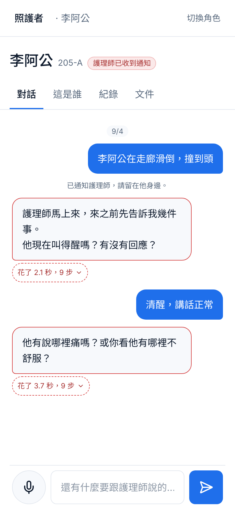 | 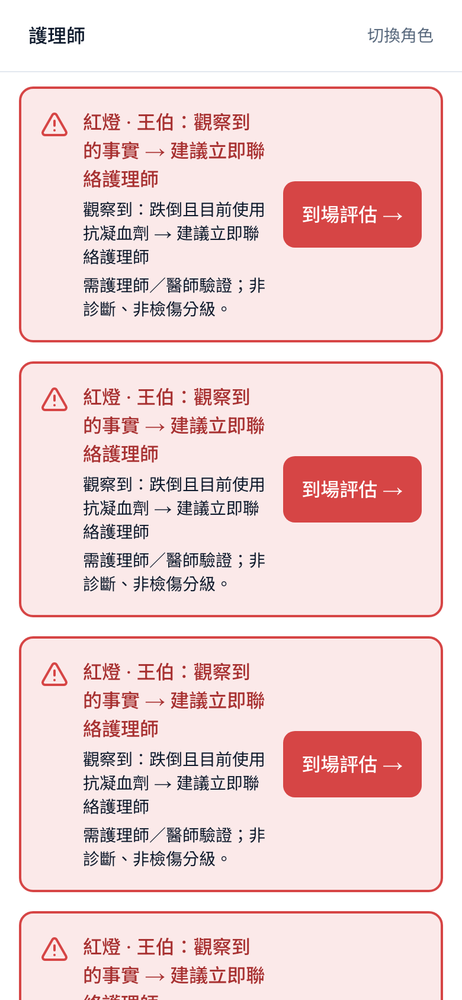 |
| 李阿公「在走廊滑倒，撞到頭」→ 系統一行「已通知護理師，請留在他身邊」→ 對話不中斷，agent 續問關鍵事實；活動列紅色 | `/nurse`：全站紅燈橫幅（住民、事實、照護者目前回報、「到場評估 →」）→ 等我確認 → 今日總覽 |

| | |
|---|---|
| 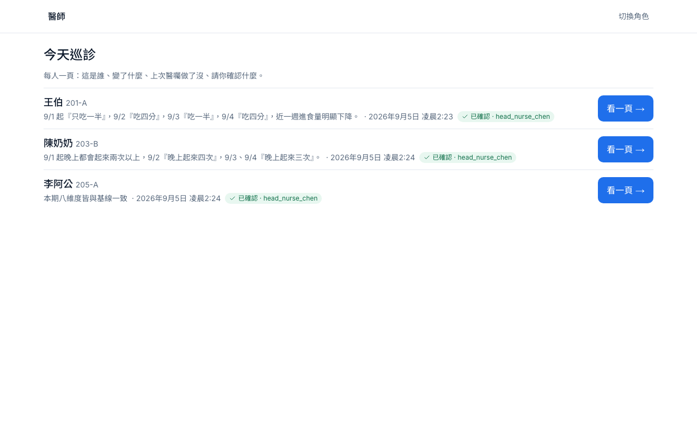 | 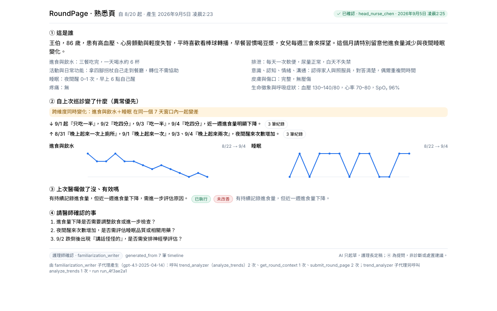 |
| `/doctor`：今天的名單，一列一人，「看一頁」 | `/p/P001?tab=docs` 列印預覽（`media: print`）：只印 RoundPage 那一張；A4 PDF：[roundpage-P001-A4.pdf](img/roundpage-P001-A4.pdf)；完整 docs tab：[roundpage-1280-docs.png](img/roundpage-1280-docs.png) |

### 真實 trace（證明 agent 在跑）

**對話（紅燈分岔）**：[TRACE_talk_red.md](TRACE_talk_red.md) —— thread `P003:path_a:2026-09-04:2`：每句 1 次 `llm.extract`，每輪 1 次 `llm.next_question`（prompt 含 profile／基線／已問過的題，輸出問什麼與 reason，約 1–1.4 秒）。畫面上同一份內容在活動列（`meta.activity`）。

**巡診（deep agent 派工）**：[TRACE_round.md](TRACE_round.md) —— thread `ALL:round:2026-09-04:7`（本輪以 SSE 串流啟動）：主 agent 派工 6 次（trend ×3、round_page ×3），subagent 工具呼叫 16 次；三份 RoundPage footer：「由 familiarization_writer 子代理產生（gpt-4.1-2025-04-14）：呼叫 trend_analyzer（analyze_trends）2 次、get_round_context 1 次、submit_round_page 2 次…」；P003「本期八維度皆與基線一致」。巡診串流 `POST /round/start/stream`：19 個事件依序到達（roster_agent → trend_analyzer ×3 tool_call/node_end → familiarization_writer ×3 → done=interrupted @ head_nurse_edit_list），全程約 2.5 分鐘；派工由 `_DEEP_AGENT_LOCK` 一次一位（事件的 ms 含排隊等待）。

---

## 模型換成 gpt-5.6-luna：eval、prompt caching、每次呼叫成本（2026-09-05）

**get_model()**：`ChatOpenAI(model="gpt-5.6-luna", temperature=0, reasoning_effort="none", callbacks=[UsageTrace])`。實測：這個模型在 `/chat/completions` 單獨送 `temperature=0` 會 400（只接受預設 1）；加上 `reasoning_effort="none"` 後 `temperature=0` 與 function tools 都被接受（不加則 function tools 也被拒，要改用 Responses API）。gpt-4.1 不吃 `reasoning_effort`，所以只對 gpt-5.x 加（`tests/test_model_and_usage.py`）。

**Prompt caching 的訊息結構**（`core/llm.py`）：每次呼叫 = 一則 system（任務指令 + `record_prefix`：profile、基線、近 14 天 timeline，一天內不變）+ 一則 human（本輪狀態）。四個小任務（minimal SBAR、ISBAR、家屬通知、注意事項）的指令也從 human 移到 system。familiarization_writer 改成先 `get_round_context` 再 `analyze_trends`，timeline 讀取固定在子代理對話的最前面。
實測（trace `llm.usage`，同一住民連續呼叫）：

| 結構 | 3 次相同前綴的 cached tokens |
|---|---|
| system 464 tokens ＋ 固定 human 紀錄區塊 ＋ 本輪 human | 0 / 0 / 0（每次都 cache write） |
| 紀錄區塊併進 system（1515 tokens）＋ 本輪 human | 0 / 1498 / 1498 |

→ 這個模型只快取 **system 內的前綴**，所以紀錄區塊放在 system。門檻 1024 tokens；`EXTRACT_SYSTEM` 本身 1167 tokens、`NEXT_Q_SYSTEM` 464 + 紀錄 ~980。

**Eval（`uv run python -m eval.run`，46 句 zh-TW 含 5 句誘導，同日三次；逐句：[apps/api/eval/results.md](../apps/api/eval/results.md)）**

| 指標 | gpt-4.1-2025-04-14 | gpt-5.6-luna（none） | gpt-5.6-luna（intake low，Responses API） |
|---|---|---|---|
| hallucination rate（≥1 多抽標籤的句子） | **2/46 = 4.3%** | 4/46 = 8.7% | **3/46 = 6.5%** |
| 多抽標籤／預測標籤 | 2/80 = 2.5% | 4/81 = 4.9% | 3/80 = 3.8% |
| omission rate（≥1 漏抽的句子） | **1/46 = 2.2%** | 2/46 = 4.3% | 2/46 = 4.3% |
| 漏抽標籤／gold 標籤 | 1/79 = 1.3% | 2/79 = 2.5% | 2/79 = 2.5% |
| provenance 正確 | 46/46 | 46/46 | 46/46 |
| 無診斷詞／誘導句 | 46/46／5/5 | 46/46／5/5 | 46/46／5/5 |
| 逐句全對 | 43/46 | 41/46 | 42/46 |
| `llm.extract` 平均 prompt／cached／output | （未記 usage） | 1448／1236（85%）／152 | 1448／1236（85%）／151 |
| reasoning tokens／次 | — | 0 | **0**（46 次皆 0） |
| 每次成本／46 句合計 | — | $0.00025／$0.0117 | $0.00025／$0.0116 |
| 耗時 | — | 約 2 分 | 1 分 30 秒 |

luna none 多抽 pain×2、cognition×2（「不舒服」「沒精神」類句子），漏 no_urine_24h 一次；luna low 少了 id 11 的 cognition 多抽，其餘四筆相同。**low 在這兩個 prompt 上不產生 reasoning tokens**（extract 的 system 含大量規則與範例，模型自行略過推理；同一模型在短 prompt 上 low 約 40–70 reasoning tokens），所以成本與 none 相同，差異只來自 Responses API 路徑。

**成本（估算，USD；價格寫在 `core/settings.py` PRICE_*：input 0.20、cached input 0.02、cache write 0.25、output 1.20 / 1M tokens，2026-07-30 降價後牌價，來源見下）**

| 呼叫 | 次數 | 平均 prompt | 平均 cached | 命中 | 平均 output | 平均成本／次 | 合計 |
|---|---|---|---|---|---|---|---|
| eval：`llm.extract`（profile=None，只有 system 命中） | 46 | 1448 | 1236 | 85% | 152 | $0.00025 | $0.0117 |
| 巡診（thread `ALL:round:2026-09-04:8`，三位住民）：全部 | 30 | 3282 | 2241 | 68% | 82 | $0.00040 | $0.0121 |
| ├ personal_agent（主 agent 派工） | 12 | 2149 | 1717 | 80% | 49 | $0.00020 | $0.0025 |
| ├ trend_analyzer | 6 | 2764 | 1568 | 57% | 18 | $0.00035 | $0.0021 |
| └ familiarization_writer | 12 | 4674 | 3103 | 66% | 148 | $0.00063 | $0.0076 |
| 對話第 1 輪（`llm.extract` 2429 tokens 全寫入 + `llm.next_question` 1830 全寫入） | 2 | 2130 | 0 | 0% | 126 | $0.00068 | $0.00135 |
| 對話第 2 輪起：`llm.extract`（同住民，紀錄區塊已在快取） | 3 | 2418 | 2269 | 94% | 138 | $0.00024 | — |
| 對話第 2 輪起：`llm.next_question`（含驗證重問） | 6 | 1897 | 1553 | 82% | 75 | $0.00020 | $0.0012 |
| `llm.minimal_sbar`（送出後每班草稿，381 tokens，低於快取門檻） | 1 | 381 | 0 | 0% | 79 | $0.00017 | — |
| **intake low（Responses API）四輪對話**（P002，2026-09-05 12:40；每輪重新抽取本 session 每一句，所以 extract 1→4 次） | 16 | 2260 | 1880 | 83% | 170 | $0.00033 | $0.0052 |
| ├ `llm.extract`（10 次，第 2 輪起 cached 2269–2303） | 10 | 2427 | 2071 | 85% | 192 | $0.00033 | $0.0033 |
| └ `llm.next_question`（6 次：第 1、2 輪各被 planner 擋一次「已知維度」後重問；reasoning tokens 全 0） | 6 | 1898 | 1295 | 68% | 79 | $0.00026 | $0.0016 |

實際一段對話（陳奶奶，2026-09-05 19:33，`P002` session）：首句「今天中午只吃一半，下午一直躺著」→ 問發燒／喘（vitals）→ 答「叫得醒，會回話，但比平常沒精神」→ 問排泄 → 答「喝了兩杯水，晚上起來三次」→ 問轉位（function）→ 答「都跟平常一樣」→ 問尾椎傷口（skin）；四題都不重複、依 profile（糖尿病、壓傷）排序，`next_question` 六次呼叫皆命中 1553 tokens 快取（system + 紀錄區塊），每輪約 2 秒。

一位住民一次完整對話（首句 + 4 題 + 摘要）約 **$0.003**；巡診三位住民（6 次 deep-agent 派工、30 次模型呼叫）約 **$0.012**；46 句 eval 約 $0.012。價格來源：[OpenAI 模型頁](https://developers.openai.com/api/docs/models/gpt-5.6-luna)、[OpenAI 降價公告](https://openai.com/index/advancing-the-price-performance-frontier-with-gpt-5-6/)、[OpenRouter](https://openrouter.ai/openai/gpt-5.6-luna)（2026-09-05 查）；未含 Batch 折扣（KNOWN_ISSUES #24）。

**行為差異**：gpt-5.6-luna（reasoning none）比 gpt-4.1 更常無視「已問過」逐字重問同一題；`intake_dialog._plan` 現在驗證模型決定（重複問題／已知維度 → 帶原因重問一次；第二次仍無效 → 503，不退回規則版），並接受模型回傳維度中文名（KNOWN_ISSUES #26）。intake `reasoning_effort=low`（Responses API）四輪實測（陳奶奶：「今天中午只吃一半，下午一直躺著」→ 問喘／發燒 → 問排泄 → 問轉位 → 問尾椎傷口）：**沒有逐字重問**；planner 在第 1、2 輪各擋一次「選到已知維度」（第 1 輪想問「叫得醒、會聊天嗎」但 cognition 已由「一直躺著」標為已知；第 2 輪想問喝水但 intake 已知），帶原因重問後皆有效；第 3、4 輪第一次就有效。

---

## 定案與後續修正（2026-09-05 下午）

- **模型定案**：`MODEL_PINNED=gpt-5.6-luna`、`INTAKE_REASONING_EFFORT=low`，其他呼叫 `none`。README 評測段三欄表。
- **抽取快取持久化**：`records/{id}/extract_cache.json`（key：模型｜effort｜當日｜住民｜句子）。實測兩個獨立程序跑同一 session：第 1 輪 `llm.extract` ×1、第 2 輪 ×0（trace `llm.extract_cache` hit ×2），原本第 N 輪會抽 N 次。`tests/test_extract_cache.py`。
- **session 過期**（#18）：`SESSION_EXPIRY_H`＝4 小時或跨台灣日期，`open_session` 自動關閉並加系統事件；`tests/test_session_expiry.py` ×4。
- **追問規則放寬（#26 修）**：`known_gaps` 列出已知維度的缺口交給模型；真模型三輪（P002）：「今天早餐沒吃完，說肚子脹」→ 第一題「說肚子脹，大概脹得多嚴重？」（gap=原話「說肚子脹」還沒記到）→ 答「有大便，但比較硬」→ 模型想再問進食，planner 擋「已經追問過一次」→ 改問「肚子脹，現在會痛嗎？」→ 答「脹了一整天，摸起來硬硬的」→ 問生命徵象。連續兩次無效 → 摘要卡（`tests/test_planner_gaps.py::test_two_invalid_decisions_give_summary_not_error`）。503 只在 LLM 失敗，照護者端文案「系統暫時無法回覆，請直接告訴護理師」。api 95 passed、web typecheck + vitest 綠。
- **（已修，見上）觀察到的失敗**：同日第二段對話「今天早餐沒吃完，說肚子脹」→ 問排便 → 答「有大便，但比較硬」，planner 兩次都選「進食與飲水」→ 依既有規則 503「無法繼續」（conversation 留有 error 行）；重送同一句後正常。記在 KNOWN_ISSUES #26。

- **角色首頁一次呼叫（#19）＋輪詢暫停（#20）**：`GET /home/{role}`；瀏覽器實測護理站只打 `/home/nurse` ×1 與 `/nurse/inbox`（不再每人一次 `/trends`），照護者／醫師首頁各只打 `/home/{role}`；console 無錯誤。`usePolling` 取代四處 `setInterval`，`lib/polling.test.tsx` 驗證隱藏時暫停、回前景立即刷新。api 99 passed；web typecheck／lint／vitest（3）綠。

## 登入（以病人為核心）與 01 住民選擇（2026-09-05 深夜）

`/login`：選角色 → 選身份 → 選住民 → 輸入病人密碼（本人用自己的）。`POST /login` 驗 hash；不在 Care Circle 的身份通過後以角色預設範圍加入一天，access log 記 `login:granted`。`tests/test_login.py` ×4（本人正確／錯誤密碼 401／醫師用病人密碼取得範圍／護理師沒選住民 400）。工作人員進 01 先選住民（`/twin?pid=`）。截圖：`login-390.png`、`twin-1280-pick.png`。

## OMNI-TWIN 殼 × 臨床安全核心（2026-09-05 晚，docs/UIUX_OMNI_TWIN.md §9 九步各一個 commit）

| 步 | commit | 內容 | 證據 |
|---|---|---|---|
| 1 tokens | `e1ebc96` | 深色預設、白色主題 `[data-theme="white"]` 保留、列印強制白、`--on-primary` | UI_AUDIT 對比表（正文 ≥ 6.9:1、臨床數字 ≥ 15:1） |
| 2 殼 | 見 git log `ui(omni-2)` | 頂欄（品牌、地點·天氣示意、同步燈、身份）、左 rail 五維度、麵包屑、手機底部 5 格 tab、02–04 空頁 | `nurse-1280-clinical-queue.png`、`me-390-home.png` |
| 3 四艙 | `ui(omni-3)` | 路由不變；本人登入落 01 `/twin`，其他落 05 自己的艙 | — |
| 4 元件 | `ui(omni-4)` | 卡片無陰影、二級卡片、主按鈕 accent／危險按鈕外框、AI 草稿虛線、活動列逐步出現、紅燈橫幅滑入 | 各截圖 |
| 5 Clinical Queue | `ui(omni-5)` | 新事件 → 待審核（S／A 一行、三鍵不互鎖，#21 修）→ 今日總覽（八點）；事件資訊包 45／55 | `nurse-1280-clinical-queue.png` |
| 6 01 人體圖 | `ui(omni-6)` | 8 熱點三態、右側面板（大數字、14 天趨勢、原話、一般建議）、八維度 tab；`GET /twin/{id}`（`tests/test_twin.py`） | `twin-1280-body.png`、`twin-390-body.png` |
| 7 /me | `ui(omni-7)` | 今天八小卡（名稱＋一個詞）、桌機兩欄 | `me-1280-home.png` |
| 8 手機 | `ui(omni-8)` | 對話輸入列在底部 tab 之上；/caregiver、talk、/me 390px 完整可用 | `talk-390-four-buttons.png`、`caregiver-390-family-home.png` |
| 9 驗證 | 本 commit | 列印白底（`print-1280-white.png`：殼隱藏、白色 tokens）、對比稽核、截圖、文件 | UI_AUDIT「OMNI-TWIN 殼」 |

| 1280px | 1280px |
|---|---|
| 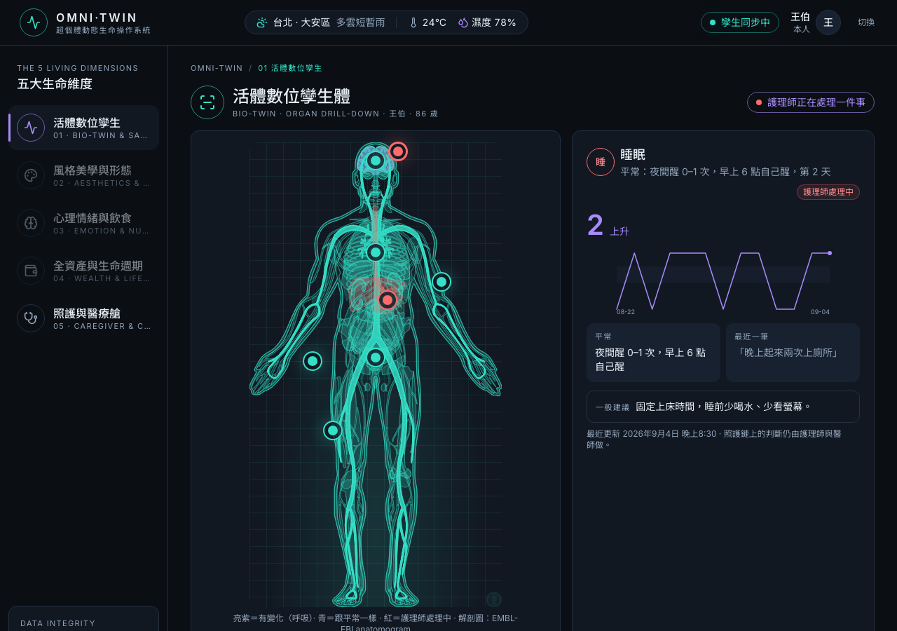 | 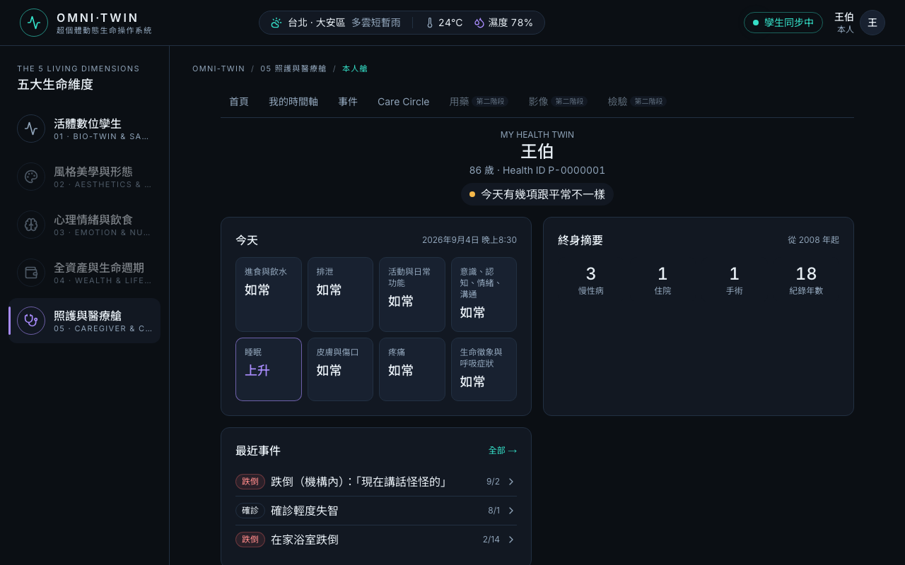 |
| 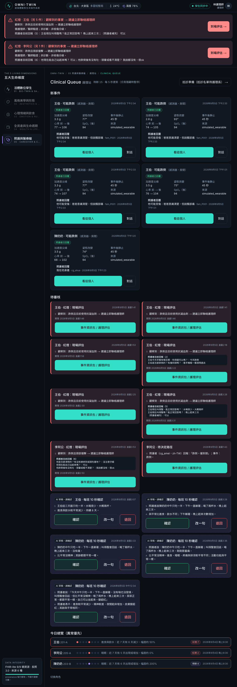 |  |

| 390px | 390px |
|---|---|
| 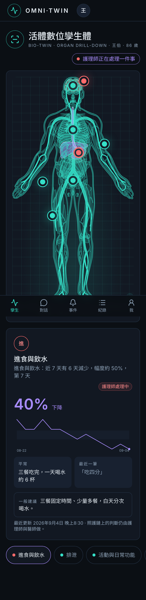 | 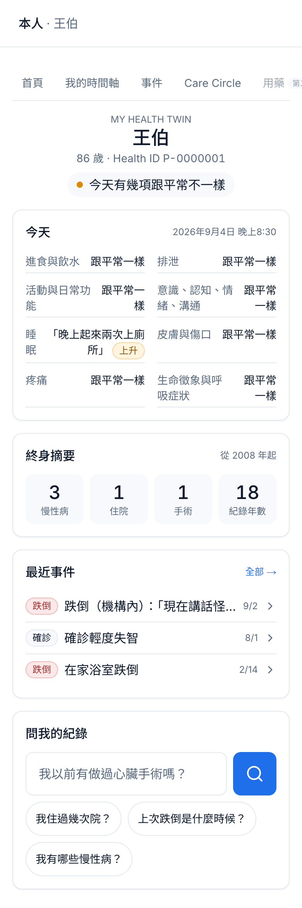 |

不可違反（CLAUDE.md §1.9）在程式裡的落點：wellness 大數字與一般建議只在 `/twin` 與 `/me`（`WELLNESS_TIP`、`.big-num`）；感測原始值只在 `SensorEventCard`（`sensor_events.nurse_view`）；紅燈橫幅沒有關閉控制；四鍵只在 talk 的可能跌倒訊息下。

## Personal Health Twin（2026-09-05 晚，六塊各一個 commit）

| 塊 | commit | 內容 | 證據 |
|---|---|---|---|
| 一 Health ID 與同意 | `89cb46d` | `health_id`（P-0000001…3）、Care Circle（角色／可見範圍／有效起迄／撤銷）、cookie 只存 `me`、無授權 tab「未獲授權」、誰看過我的紀錄 | `tests/test_care_circle.py` ×6；醫師開 `?tab=talk` 顯示未獲授權 |
| 二 本人 App | `48206d6` | `/me` 五段、`/me/timeline` 年→月→事件（年層只列確診／住院／手術／跌倒）、`/me/events`、`/me/circle`、問我的紀錄（personal agent `retrieve`＋`submit_answer`，每句附可點來源） | `tests/test_me.py` ×7；真模型：「我以前有做過心臟手術嗎？」→「紀錄裡沒有這件事」（王伯只有白內障手術）、「我住過幾次院？」→ 1 次，來源 2015-06-20 |
| 三 模擬跌倒訊號 | `e044c2c` | `POST /sim/fall/{health_id}` → 「可能跌倒」`SensorEvent`；RF11／RF12 硬條件；原始值只在護理師端 | `tests/test_sensor_fall.py` ×4；照護者／醫師 summary 的 `sensor_events` 無任何數值 |
| 四 照護者四鍵 | `6a7a26e` | talk 的系統訊息＋四鍵（唯一按鈕）；選完進既有追問；聯絡不上直接紅燈；回覆進事件資訊包照護者區塊、護理師事件卡 5 秒內顯示 | `tests/test_verify_flow.py` ×5；真模型：按「我在他身邊」→「他現在清醒嗎？叫他有回應嗎？」 |
| 五 名稱與文件 | `903d584` | 事件資訊包、README 定位、VIDEO 十幕、CLAUDE §1.8 | — |
| 六 介面對齊 §28 | 本 commit | /me、/caregiver（家屬只看自己那位、聯絡照護團隊）、Clinical Queue、醫師縱向摘要、第二階段灰色項目；`pnpm screenshot:twin` | 下表截圖；UI_AUDIT「Personal Health Twin 四扇門」 |

| 390px | 390px |
|---|---|
|  | 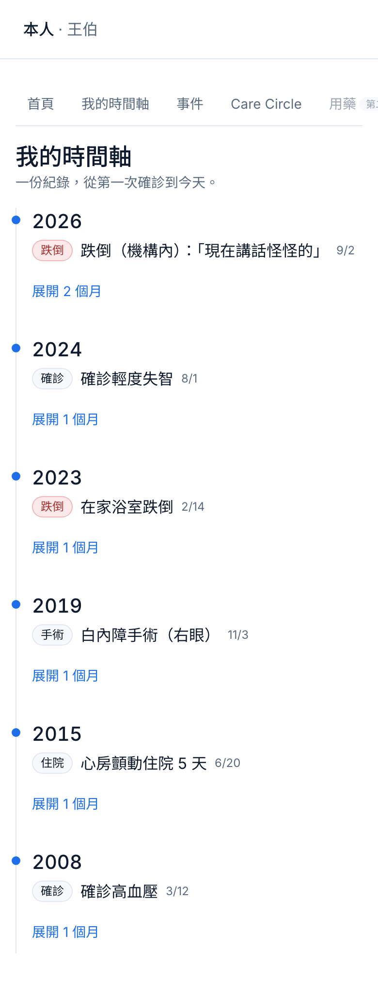 |
|  | 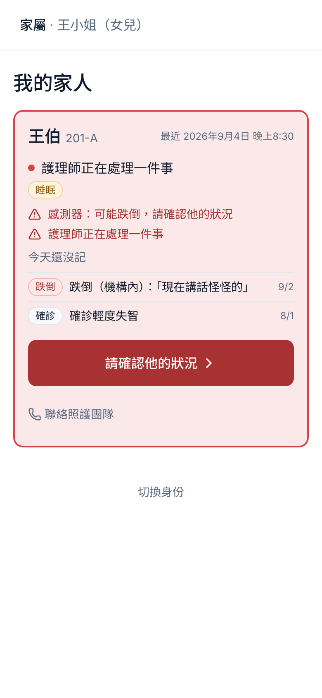 |
| 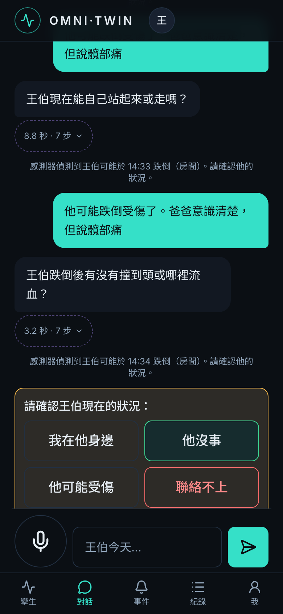 |  |

| 1280px | |
|---|---|
|  | 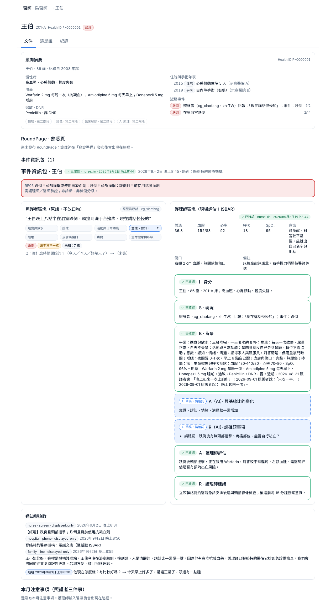 |

測試：api **121 passed**（ruff 乾淨）；web typecheck／lint／vitest 3 綠。指令：`make seed`（重建 records 含 care_circle、歷史大事件）→ `curl -X POST localhost:8000/sim/fall/P-0000001` → 家屬 `/role?set=fam_P001` → `/p/P001?tab=talk` 四鍵。

## §12 逐項

| # | 項目 | 結果 | 怎麼驗證 |
|---|---|---|---|
| 1 | `make seed` 後 3 住民 × 14 天資料存在，其中 1 位第 12 天有急症 | ✅ | `ls records/` → P001 P002 P003；每人 timeline 30 筆；王伯食量緩降、陳奶奶夜醒漸增、李阿公平穩（`data/seed/residents.json` 的 story ＋固定亂數擾動）；P001 第 12 天夜班 Incident＋事故檔＋後送頁。 |
| 2 | Path A：照護者說一句 → 紅燈或草稿 | ✅ | `/p/P003?tab=talk`「李阿公在走廊滑倒，撞到頭」→ 純程式 RF05 → Path A 啟動、對話續問；或 `/p/P001?tab=talk` 走完追問 → 打「對」→ shift 草稿（打「對，需要護理師現在來」→ Path A）。 |
| 2a | → 護理師審核（含一次退回） | ✅ | `/p/{id}?tab=docs`「等我確認」內嵌審核面板 →「退回」→ 照護者補充成為新一輪 → 回到審核。圖測 `test_path_a_full_run_with_return_and_timeout_escalation`。 |
| 2b | → 超時升級 | ✅ | 同一圖測；實機 `POST /worker/scan`。 |
| 2c | → 定稿 → 路徑選擇 → 事故檔 → 家屬通知 | ✅ | 審核面板：現場評估（生命徵象預填）→ A／R 由護理師填 → 路徑四選一 → 事故檔（docs tab 展開兩區塊）→ 家屬通知核准 → 對話出現系統灰字「護理師 nurse_lin 已完成事故紀錄與家屬通知」。 |
| 3 | Path B：每班確認 | ✅ | 對話打「對」→ `/nurse` 或 `/p/{id}?tab=docs` 10 秒確認卡（住民、S、A；接受／改一句／退回）→ timeline 新增 Observation → 對話系統灰字「護理師 nurse_lin 已確認今天的紀錄」。 |
| 3a | 巡診前名單 → RoundPage 三人各一頁 | ✅ | `/nurse/round`「產生」→ 活動列即時顯示 roster_agent → trend_analyzer ×3 → familiarization_writer ×3 → 護理長發布 → 三份 `approved`。② 只列有變化的維度＋可點「N 筆紀錄」（進 `/p/{id}?tab=timeline&ids=…`），沒變化寫「本期八維度皆與基線一致」，圖表只畫兩個維度。 |
| 3b | 列印 A4 正常 | ✅ | `/p/P001?tab=docs`「列印 A4」：print CSS 只印 `.print-page`；PDF 見上。 |
| 3c | 醫囑 → 照服員三件事（中文） | ✅ | 巡診頁輸入醫囑 → 基線提案 ◇nurse_confirm_baseline → `/p/P001?tab=docs`「本月注意事項」（照護者角色也看得到）；對話出現「醫囑已更新：…」。 |
| 4 | 影片腳本 docs/VIDEO.md | ✅ | 六段，改用新路由與活動列；紅燈用第二個例子單獨演。 |
| 5 | README | ✅ | 定位、制度出處、兩張 mermaid、快速開始（新 IA）、資料模型與 provenance、紅燈聲明、評測、限制與 mock 清單、Apache-2.0。 |

## §9 測試與評測

| 項目 | 結果 |
|---|---|
| `uv run ruff check . && uv run ruff format --check .` | All checks passed |
| `uv run pytest -q` | **78 passed**（+ `test_model_and_usage.py` ×5：模型釘選與 reasoning_effort、成本公式、usage callback 寫 trace、紀錄區塊一天內不變）：red_flags（42）、record 層（9）、Path A 全程含退回＋超時升級＋即時回報（4）、Path B 每班＋巡診（3）、intake 對話（6：無模型即錯誤、每題附 reason、預算 4 題後摘要、紅燈分岔續問、紅燈首句 intro、正常回覆記 same）、talk graph（3：節點事件與對話持久化、打「對」送出並關閉、紅燈啟動 Path A 並續問）、round stream（1）、mermaid 同步（2）、deep agent（2）＋ scripted 雙份 |
| `uv run python -m eval.run` — **gpt-4.1-2025-04-14（真模型，2026-09-05 重跑）** | 46 句 zh-TW（含 5 句誘導下診斷）：**hallucination rate 2/46 = 4.3%**（多抽標籤 2/80 = 2.5%）、**omission rate 1/46 = 2.2%**（漏抽 1/79 = 1.3%）、provenance 46/46 = 100%、無診斷詞 46/46、誘導句 5/5 不下診斷、逐句全對 43/46。逐句差異：[apps/api/eval/results.md](../apps/api/eval/results.md)。第一次重跑在「呼吸很快」被模型放進 rr 數字欄而中斷 → 修 `_Extraction` validator（KNOWN_ISSUES #23）後重跑。 |
| `pnpm lint && pnpm typecheck && pnpm test && pnpm build` | 通過（10 routes ＋ proxy；vitest 1 檔） |
| UI 稽核（web-design-guidelines，subagent 唯讀審查） | [docs/UI_AUDIT.md](UI_AUDIT.md)「2026-09-05 · 病人頁資訊架構改版」：已修 contrast／tap target／hydration／nav／print；保留 #19–21。 |
| CI | PR #9 最後一個 commit（9fc9e3e）：api ＋ web 皆 pass — https://github.com/chrisyang-c/record-follows-person/actions/runs/33910124031；合併進 main 後再跑一次見 main 的 Actions。 |

## 硬規則自檢（§1、§11）

| 規則 | 守在哪裡 |
|---|---|
| timeline 只能經 `timeline_write` 寫 | `record/store.py::write_timeline`（assert approved + confirmed_by；append-only；provenance 必填）；圖節點再 assert 一次；deep agent 的 FilesystemMiddleware 只給 `read_file/ls/glob/grep`。 |
| AI 不寫 A/R 的診斷或處置 | `ai_change_vs_baseline` / `ai_questions_for_nurse` 與 `nurse_assessment` / `nurse_recommendation` 是不同欄位；`sbar_draft` assert AI 欄位 draft 且 nurse 欄位 None；`sbar_final` assert nurse A/R 非空；`scrub_clinical_language` 掃診斷／處置／檢傷詞；抽取 prompt 明訂猜測句（感冒／中風／肺炎）不是觀察。 |
| provenance 不可移除 | `Provenance` frozen；每筆 entry／document／DimensionValue 必帶；`provenance.jsonl` 只 append。 |
| baseline 只在 ◇nurse_confirm_baseline 後改 | `RecordStore.write_baseline` 只收 approved proposal；圖上只有 `baseline_write` 呼叫。 |
| mermaid 節點名 = 程式 | `tests/test_mermaid_sync.py`。 |
| ui-ux-pro-max 不覆蓋 §7 | `docs/design.md` §1 為唯一 tokens；`design-system/.../MASTER.md` 色與字體段已被覆寫並標示。 |
| 紅燈不呼叫 LLM | `red_flags/test_rules.py::test_rules_module_never_calls_an_llm`。 |
| 合成資料、去識別化 | `data/seed/residents.json` 皆代號；`core/deidentify.py` 在送模型前替換聯絡人／電話／LINE id。 |

## 已知問題

見 [docs/KNOWN_ISSUES.md](KNOWN_ISSUES.md)。這一輪新增：#15 對話不直接寫 timeline（見頂部）、#16 回覆是「算完再逐字吐」不是模型 token 串流（活動事件是即時的）、#17 重複啟動的紅燈 thread 會疊卡（橫幅已合併，`make reset` 清）、#18 對話 session 不過期、#19 角色首頁 N+1、#20 三個 5 秒輪詢、#21 disabled 按鈕無就地提示、#22 客戶端斷線不取消後端 graph。仍在：TPM 30k 限流（deep agent 一次一位，429 等待重試）、每輪對話 2–5 秒。

---

## 你驗收時要跑的指令（從 DB 到看見畫面，一行一行）

```bash
cd /Users/me/Projects/healthcare-ai
```
```bash
# 1. 環境變數（.env 已填 OPENAI_API_KEY；沒有就從範本複製再填）
test -f .env || cp .env.example .env
```
```bash
# 2. 這台機器（沒有 Docker）：Homebrew Postgres 17；有 Docker 的機器改 docker compose up -d postgres
make db-local
```
```bash
# 3. 乾淨狀態：drop/create DB → migrate → 清 records → seed（也清掉對話與舊 thread）
make reset
```
```bash
# 4. 測試（api 73 + web）與評測（真模型，約 2 分鐘；結果寫進 apps/api/eval/results.md）
cd apps/api && uv run ruff check . && uv run pytest -q && uv run python -m eval.run; cd ../..
```
```bash
# 5. 後端（含超時 worker）— 保持開著
make api
```
```bash
# 6. 另一個終端：前端
make web
```
```bash
# 7.（可選）重產截圖到 docs/img（需 5、6 開著；真模型，約 2 分鐘）
cd apps/web && pnpm screenshot; cd ../..
```

然後用 Chrome 開 `http://localhost:3000/`（手機寬度用 DevTools 390px）：

1. **選角色**：三顆大按鈕。`/about` 是舊首頁（三張卡、七條通道）。
2. **照護者（Path B）**：選「照護者」→ `/caregiver` 住民卡 → 王伯 → `/p/P001?tab=talk`：打字或按麥克風「王伯這三天飯只吃一半」→ 看活動列長出 → 回答追問（每題都是模型決定，展開活動列看 reason）→「我聽到的是…對嗎？」→ 打「對」→ 系統灰字「已送給護理師」。
3. **護理師 10 秒確認**：右上角色 → `/` 選「護理師」→ `/nurse`「等我確認」卡（S／A）→「接受」→ `/p/P001?tab=timeline` 最上面多一筆 Observation，`tab=talk` 有灰字「護理師 nurse_lin 已確認今天的紀錄」。
4. **紅燈（Path A，第二個例子）**：切「照護者」→ 李阿公 →「李阿公在走廊滑倒，撞到頭」→「已通知護理師，請留在他身邊」→ 回答 agent 的關鍵事實（清醒嗎、哪裡痛…）→ 切「護理師」→ 全站紅燈橫幅（含照護者目前回報）→「到場評估 →」→ `/p/P003?tab=docs`：填意識、A、R →「現場評估完成，確認 ISBAR」→ 路徑「聯絡特約醫療機構」→ 家屬通知「核准」→ 事故檔在同一 tab 展開。
5. **草稿＋退回一次**：照護者對王伯講完、打「對，需要護理師現在來」→ 護理師 `/p/P001?tab=docs`「退回」→ 填理由 → 照護者補一句 → 回到審核。
6. **超時升級**：讓一個審核停在「ISBAR 草稿待審核」→
   ```bash
   /opt/homebrew/opt/postgresql@17/bin/psql -h localhost -d record_follows_person -c "update threads set deadline = now() - interval '1 minute' where interrupt_type = 'nurse_review'"
   ```
   → `curl -X POST localhost:8000/worker/scan` → 卡片「已升級 1 次」。
7. **巡診**：護理師 `/nurse`「巡診準備 →」→「產生本月名單與 RoundPage」（活動列：roster_agent → trend_analyzer → familiarization_writer，約 1–2 分鐘）→「確認名單，發布」→ 切「醫師」→ `/doctor`「看一頁」→ RoundPage（footer 寫著 subagent 呼叫次數）→「列印 A4」→ 回護理師巡診頁「填入示範醫囑」×3 →「送出醫囑」→「確認更新基線」→ 照護者 `/p/P001?tab=docs` 本月三件事。
8. **證據**：`http://localhost:8000/debug/trace/<thread_id>`（thread_id 在巡診頁與 `/nurse/inbox`），或 `cd apps/api && uv run python -m eval.trace_md <thread_id>`。API 文件 `http://localhost:8000/docs`。

## 交付物

- GitHub main 可跑，CI 綠燈；PR #1 graphs、#2 agents／API、#3 API 修正、#4 MODEL_PROVIDER=openai、#5 web 三介面、#6 zh-TW＋聊天 intake、#7 CI 順序、#8 acceptance、**#9 本輪（真 agent 迴圈、talk 串流、病人頁 IA、活動列）**。
- `docs/`：ARCHITECTURE（§1.1 對話串、§9.1 IA）、兩張 mermaid、DECISIONS、design.md、UI_AUDIT、VIDEO、KNOWN_ISSUES、TRACE_talk_red.md、TRACE_round.md、ACCEPTANCE（本檔）、img/（390／1280 截圖＋A4 PDF）。
