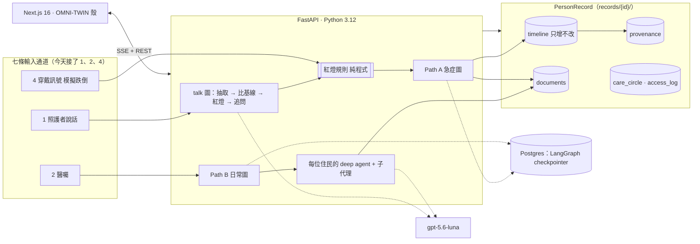

# Personal Health Twin 全貌（給第一次接觸的人）

> 一個人、一份一輩子的紀錄、一個會替他說話的 AI。對應 main 分支 2026-09-05 的狀態。
> 線上版（同內容）：https://claude.ai/code/artifact/1eaff528-8295-489e-b86c-3393b7dea551

**一句話**：每個人有一份屬於自己、跟著他走的健康紀錄；照顧他的人講一句話就能記進去，AI 只抽取、不判斷，護理師按一下才算數，醫師巡診看一頁。
**介面上的分寸**：外殼是一個人的生命作業系統（可以科幻），核心是一條經得起醫療審視的照護鏈（不能科幻）。

## 一、為什麼做這件事

長照機構裡，每天真正看著住民的是照服員，但他們不會打字、不會填表，觀察到的「今天不太想吃、走路變慢、叫她名字反應慢」從來沒進到醫療紀錄裡。醫師一個月巡診一次，靠的是護理師口頭交班。

這個專案把「講一句話」變成正式紀錄的起點，並把紀錄的主權還給本人：紀錄不屬於機構，誰能看由本人決定；機構、家裡、醫院都只是這份紀錄經過的「場域」。今天先做第一個場域：住宿式長照機構。

## 二、四扇門：誰用、看到什麼

| 門 | 誰 | 看到什麼 |
|---|---|---|
| 本人 · 01 活體數位孿生 / 05 本人艙 | 王伯 | 人體全像圖上看八個面向哪裡跟平常不一樣、終身時間軸、「問我的紀錄」、決定誰能看（Care Circle）。這裡允許 wellness 語氣：大數字、趨勢、一般建議。 |
| 家屬 / 照護者 · 05 家屬艙 | 女兒、照服員 | LINE 式對話，講一句今天怎麼樣；AI 追問到八個面向夠了為止。可能跌倒時出現全系統唯一的四個按鈕。看不到任何分數或感測數值。 |
| 護理師 · 05 護理站 | Clinical Queue | 新事件（感測原始值只在這裡）→ 待審核（確認／改一句／退回）→ 今日總覽。事件資訊包裡 A 與 R 由護理師親手寫。 |
| 醫師 · 05 醫師艙 | 一人一頁 | 縱向摘要（慢病、用藥、住院手術年表）＋ RoundPage 四段（這是誰、變了什麼、上次醫囑做了沒、請你確認什麼），白底可印 A4。 |

登入以病人為核心：本人用自己的密碼；其他人要輸入那位病人的密碼，才會進入他的 Care Circle，看到的範圍依角色不同（誰、紀錄、文件、對話四個區塊的子集），每次查看都留下「誰看過我的紀錄」。

## 三、一次事件怎麼走完（demo 主線）

1. **晚上 21:43，穿戴裝置送來一個訊號**。系統只寫下「可能跌倒」，不寫「跌倒」。原始值（加速度尖峰、靜止秒數、心率前後、SpO₂）只有護理師看得到。
2. **硬條件先由程式判**：靜止超過 60 秒或 SpO₂ 低於 92，程式直接通知護理師，完全不經 AI。其餘交人驗證。
3. **女兒的手機跳出四個按鈕**：我在他身邊／他沒事／他可能受傷／聯絡不上。她按「他可能受傷」，補一句「爸爸意識清楚，但說髖部痛」。
4. **AI 接著問，但只抽取不判斷**：「髖部痛幾分？比平常更痛嗎？」每一題都由模型依這個人的病史與基線決定，附上理由；每一句回答只被拆成八個觀察面向，原話原封不動保留。
5. **紅燈規則命中**：跌倒＋正在吃抗凝血劑，這兩個事實一出現就叫護理師，對話不中斷，女兒後續的回答即時進到護理師畫面。
6. **護理師打開事件資訊包**：左邊是照護者原話與 AI 抽取的欄位（虛線框），右邊是護理師的現場評估與 ISBAR。AI 的 A 只寫「與基線比的變化」、R 只提問；真正的評估與建議由護理師填。確認後整包變實線加綠勾。
7. **選路徑、寫進紀錄、通知家屬**：聯絡特約醫療機構／在宅急症／陪同就醫／觀察。只有核准後的內容才寫進 timeline；家屬通知是白話版，護理師核准才發。
8. **醫師巡診看一頁**：RoundPage 由 AI 子代理依 timeline 寫出四段，每句都連回原始紀錄；醫囑回來後變成照服員看得懂的三件事。

## 四、AI 在哪裡出手、在哪裡停手

**AI 可以**
- 抽取：把一句話拆成八個面向，原話為證。
- 追問：決定下一題問什麼、為什麼問，上限 4 題（紅燈 6 題）。
- 整理：寫 RoundPage、事件資訊包草稿、後送頁、家屬通知白話版。
- 回答本人：「問我的紀錄」只複述紀錄裡有的事，每句附來源行；沒有就說沒有。

**AI 不做（程式層面擋住，不是靠提示詞）**
- 不下診斷、不建議治療、不給檢傷等級；A 與 R 由護理師寫。
- 紅燈規則是純程式（`red_flags/rules.py`），不呼叫模型。
- 寫入 timeline 只有一個入口，未核准就拋錯。
- 基線只在護理師確認時更新；AI 只能提「提案」。
- 模型掛掉就顯示「系統暫時無法回覆，請直接告訴護理師」，不退回規則版。

**八個觀察面向（所有通道共用）**：進食與飲水、排泄、活動與日常功能、意識認知情緒溝通、睡眠、皮膚與傷口、疼痛、生命徵象與呼吸症狀。另有跨面向旗標「跟平常不一樣」，照服員不必解釋就能按。觀察範圍參考 INTERACT Stop and Watch，措辭為本專案自訂。

## 五、紀錄長什麼樣（資料模型）

| 區塊 | 內容 | 誰能改 |
|---|---|---|
| Health ID 與 profile | P-0000001 這種一輩子的號碼；慢病、過敏、用藥、DNR、緊急聯絡人、目前所在場域 | 匯入或護理師 |
| baseline 基線 | 八個面向的「平常」，每筆有起迄與設定者 | 只在護理師確認提案時更新 |
| timeline 時間軸 | 只增不改：每班觀察、事件、巡診、醫囑、終身大事件（確診、住院、手術、跌倒） | 只經 `timeline_write`，且必須已核准 |
| documents 文件 | RoundPage、事件資訊包、後送頁、照護者注意事項 | 核准後寫入，可補後續通知 |
| provenance 來源 | 每一行：誰說的、AI 抽的、護理師確認的、醫囑、系統推導；原文與時間 | 不可移除、不可改寫 |
| Care Circle 與 access log | 成員、角色、可見範圍、有效起迄、撤銷；誰在何時看了什麼 | 本人或家屬 |
| 對話與感測事件 | 每輪對話（含 AI 活動步驟）、可能跌倒事件與四鍵驗證，放在 timeline 旁邊，不是正式紀錄 | 系統 |

命名對照 FHIR（Patient、Condition、Observation、Encounter、Provenance…），但不做 FHIR server。全部是合成資料，姓名為代號，送模型前先去識別化。

## 六、系統怎麼搭起來（技術架構）



| 層 | 選擇 | 為什麼 |
|---|---|---|
| 前端 | Next.js App Router、TypeScript strict、Tailwind、深色 OMNI-TWIN 殼；型別由 Python schema 產生（`make codegen`） | 一套型別兩邊用；殼可以換皮，路由與元件不動 |
| 後端 | FastAPI、Pydantic v2、uv、ruff、pytest | 型別完整、測試快 |
| 流程引擎 | LangGraph 兩張圖（節點名以 mermaid 檔為準，有測試比對）；人工閘門用 `interrupt()`；超時由背景 worker 升級 | 「人才定稿」是流程結構，不是提示詞 |
| 代理 | deepagents：每位住民一個 agent，只讀自己的紀錄目錄；三個子代理各自隔離，只回結構化結果 | agent 沒有自己的狀態，紀錄是唯一資產 |
| 模型 | gpt-5.6-luna；抽取與追問 reasoning=low（Responses API），其餘 none；紀錄區塊放在 system 以命中快取 | 三個設定同日評測差距在一句之內，選成本最低的；每輪對話約 0.001–0.003 美元 |
| 儲存 | 每位住民一個目錄（JSON 檔）＋ Postgres 存流程狀態 | demo 可讀、可 diff；正式版換資料庫不影響上層 |
| 權限 | cookie 只存「我是誰」；每次讀取查 Care Circle，無授權的區塊顯示「未獲授權」而非 404 | 授權屬於病人的紀錄，不屬於登入狀態 |
| 可觀測 | 每次模型呼叫、追問理由、子代理工具呼叫都寫 trace；每則回覆下有「花了幾秒、幾步」可展開 | 評審能看到 agent 真的在跑 |

## 七、七條不可違反的紅線

1. 紀錄是唯一資產，agent 沒有自己的狀態。
2. AI 只起草，人才定稿；未核准的東西進不了 timeline。
3. ISBAR 的 A 與 R 由護理師撰寫；AI 不出現診斷、治療、檢傷等級。
4. 紅燈是純程式；命中就通知，跳過起草。
5. 每一行有來源，provenance 不可改。
6. 合成資料、去識別化後才進模型。
7. 任何分數、機率、信心值、建議語句只允許在本人的 wellness 區；家屬、護理師、醫師頁面沒有。感測原始值只在護理站；紅燈橫幅不可關閉；四鍵是全系統唯一的按鈕式回覆。

## 八、現在做到哪裡

**已完成，可 demo**
- Path A 急症與 Path B 日常兩條流程走完，含退回與超時升級
- 照護者對話：模型決定每一題、缺口驗證、摘要卡；抽取快取、session 過期
- Health ID、Care Circle、access log、以病人為核心的登入
- 本人 App：全像人體圖（EMBL-EBI 解剖向量圖）、終身時間軸、問我的紀錄
- 模擬跌倒訊號、硬條件紅燈、四鍵驗證、事件資訊包
- OMNI-TWIN 深色殼、列印白底、對比稽核；api 127 個測試、web 型別與 lint 全綠
- 評測：46 句合成語句，provenance 100%、無診斷詞 100%、hallucination 6.5%

**第二階段（明確不做）**：Health Graph 知識圖；真實穿戴裝置、醫院 EHR／FHIR 對接；多語（印尼語、越南語）介面；02 風格美學、03 心理情緒飲食、04 全資產生命週期；用藥、影像、檢驗頁；3D 人體模型；API 簽發的登入 token。

## 九、怎麼跑起來、在哪裡看細節

```bash
make db-local && make migrate && make seed   # 三位合成住民 14 天資料
make api                                     # 另一個終端 make web
curl -X POST localhost:8000/sim/fall/P-0000001   # 觸發一筆「可能跌倒」
```
瀏覽器開 `localhost:3000` 登入（示範密碼＝住民出生年）。

| 想知道 | 看哪裡 |
|---|---|
| 開發規則與紅線 | `CLAUDE.md` |
| 設計稿、兩張流程圖 | `docs/ARCHITECTURE.md`、`docs/*.mermaid` |
| 願景與介面規格 | `docs/VISION_personal_health_twin.md`、`docs/UIUX_OMNI_TWIN.md` |
| 驗收證據、截圖、成本 | `docs/ACCEPTANCE.md`、`docs/img/` |
| 為什麼這樣決定、已知問題、交接 | `docs/DECISIONS.md`、`docs/KNOWN_ISSUES.md`、`docs/HANDOFF.md` |
| 影片十幕腳本 | `docs/VIDEO.md` |
